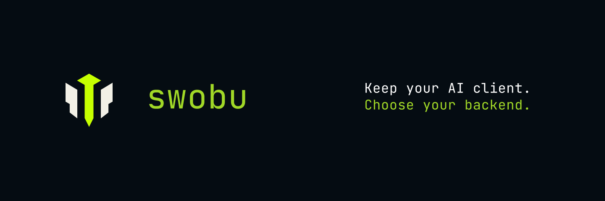
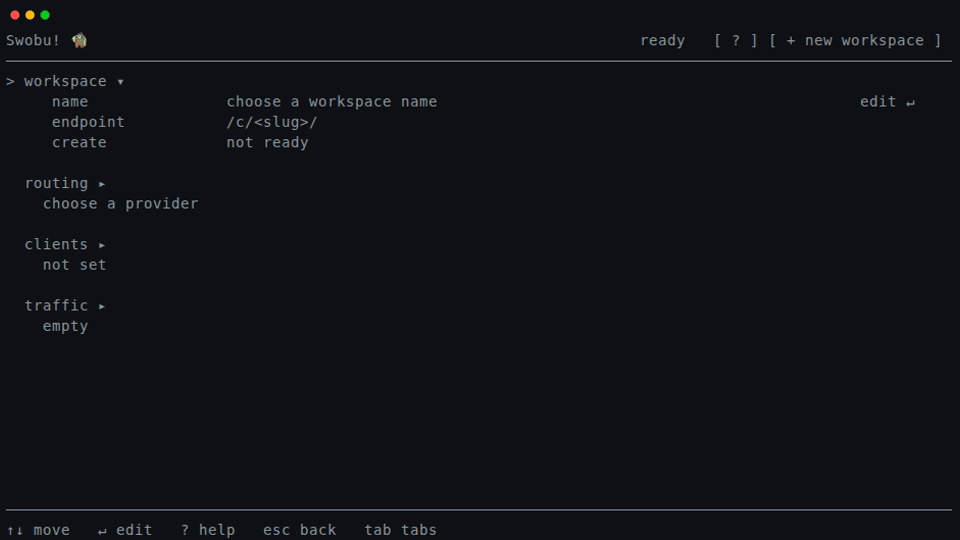

# Swobu



**Keep the AI tools. Control the traffic.**

Swobu is a local AI control boundary for coding tools and LLM clients.

Point Claude Code, Codex CLI, Continue, or another OpenAI/Anthropic-compatible client at Swobu. Route traffic to OpenAI, Anthropic, OpenRouter, Ollama, or a custom OpenAI-compatible backend.

The client should not decide where your AI traffic goes.

---

## Why Swobu

AI coding clients multiply fast, and each tends to carry assumptions about:

- provider choice
- API shape
- streaming behavior
- auth handling
- error shape

Swobu sits between client and backend so you can:

- keep your preferred client
- swap providers without rebuilding workflow glue
- route local and hosted models through one boundary
- compare backends from the same client experience
- inspect local traffic health
- avoid SDK lock-in

**Standardize the boundary, not the tool.**

---

## Demo



---

## Install

```sh
curl -fsSL https://swobu.com/install.sh | sh
```

Launch Swobu:

```sh
swobu
```

In cockpit:

1. Create or select a workspace.
2. Choose a backend provider.
3. Configure base URL and auth.
4. Copy the local endpoint shown by Swobu.
5. Point your AI client at that endpoint.

Check health:

```sh
swobu status
```

Stop Swobu:

```sh
swobu down
```

---

## 60-second shape

Typical OpenAI-style client config:

```sh
OPENAI_BASE_URL=http://127.0.0.1:7926/v1
OPENAI_API_KEY=swobu
```

Anthropic-style clients use the corresponding Swobu-supported Anthropic surface.

Exact environment variables depend on the client.

---

## What works today

### Tested clients

- Claude Code
- Codex CLI
- Continue
- OpenAI-compatible clients
- Anthropic-compatible clients

### Supported backends

- OpenAI
- Anthropic
- OpenRouter
- Ollama
- ChatGPT
- Custom OpenAI-compatible backends

### Supported request families

OpenAI-style:

- `/v1/chat/completions`
- `/v1/responses`
- `/v1/completions`

Anthropic-style:

- `/v1/messages`

### Streaming

- Server-Sent Events
- WebSocket

Swobu is beta. Expect sharp edges.

---

## Cockpit

Swobu includes a local terminal cockpit for setup and operation.

Use it to:

- create, rename, and delete workspaces
- choose backend/provider per workspace
- configure routing and auth references
- inspect readiness and health
- inspect traffic outcomes
- open help and feedback actions

Cockpit is the primary local operator surface.

---

## Command surface

```sh
swobu                         # launch cockpit
swobu daemon                  # run daemon in foreground
swobu status                  # inspect daemon health
swobu down                    # stop daemon
swobu telemetry status        # inspect telemetry setting
swobu telemetry on            # enable telemetry
swobu telemetry off           # disable telemetry
swobu version                 # print version
```

Help:

```sh
swobu --help
swobu daemon --help
swobu status --help
```

---

## Scripted / non-interactive use

Run the daemon directly:

```sh
swobu daemon
```

Use an explicit config path:

```sh
swobu daemon --config /path/to/swobu.yaml
```

Check from scripts or CI:

```sh
swobu status
```

Health semantics:

- exit `0`: healthy
- exit `1`: running but uninitialized or degraded
- exit `2`: daemon not reachable

Shutdown:

```sh
swobu down
```

---

## Run from source

Latest `master`:

```sh
go run github.com/swobuforge/swobu/cmd/swobu@master --help
```

Install from source:

```sh
go install github.com/swobuforge/swobu/cmd/swobu@master
swobu --help
```

Use this when you want source behavior instead of the install-script channel.

---

## What Swobu is

Swobu is:

- a local AI compatibility layer
- a protocol shim
- a client/backend boundary
- a local operator cockpit
- a way to hot-swap LLM backends behind existing AI clients

## What Swobu is not

Swobu is not currently:

- an SDK
- a hosted model marketplace
- a new AI client
- an observability platform
- a prompt management system
- a managed enterprise gateway

---

## Security and privacy

Swobu is local-first.

By default, Swobu:

- binds to loopback
- keeps control on your machine
- does not send prompts, completions, or auth material through default telemetry

Telemetry can be turned off:

```sh
swobu telemetry off
```

Local-first is not offline-only.

If you configure a hosted backend, AI requests still go to that backend.

---

## Roadmap direction

Near-term focus:

- deeper client profiles
- deeper backend profiles
- better config generation
- better compatibility diagnostics
- clearer error translation
- stronger streaming support
- safer local defaults
- easier backend hot-swapping

Goal:

**Make it boring to connect any supported AI client to the backend you choose.**

---

## Contributing

Contributions are welcome.

Swobu uses a Contributor License Agreement.

By submitting a pull request or other contribution, you agree to the terms in [`CLA.md`](./CLA.md). This allows Swobu to maintain, sublicense, dual-license, and relicense contributions in the future.

Read [`CONTRIBUTING.md`](./CONTRIBUTING.md) before opening a pull request.

---

## Security

Do not report security vulnerabilities in public issues.

See [`SECURITY.md`](./SECURITY.md).

---

## Commercial licensing

For commercial licensing and additional permissions:

- `contact@swobu.com`

---

## License

Swobu is released under AGPL-3.0-only.

See [`LICENSE`](./LICENSE).
