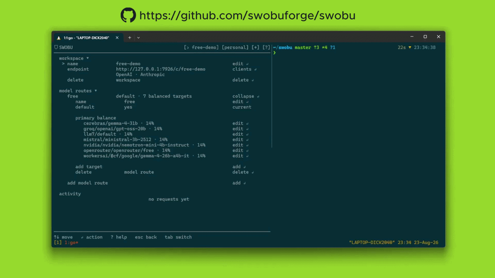
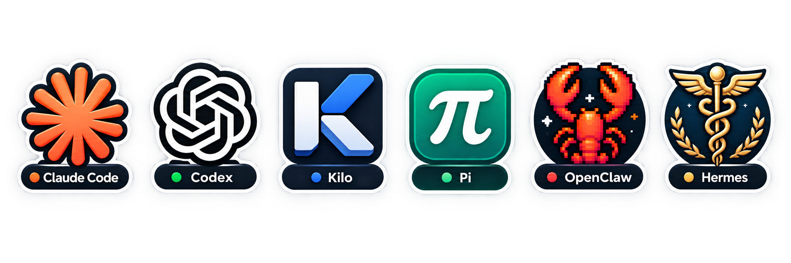

# Swobu

**English** · [简体中文](README.zh-CN.md) · [日本語](README.ja.md) · [Português (Brasil)](README.pt-BR.md) · [Bahasa Indonesia](README.id.md) · [한국어](README.ko.md) · [Русский](README.ru.md) · [Español](README.es.md) · [Українська](README.uk.md)

**One endpoint for your AI agents. Any LLM capacity underneath.**

Make AI capacity routable. Your agent asks for a model. Swobu turns that model name into a route across providers, accounts, regions, and local servers — with balancing, failover, reasoning translation, and semantic protocol compatibility underneath.

<p align="center">
  
</p>

[Documentation](https://swobu.com/docs/) · [Quickstart](https://swobu.com/docs/start/first-route/) · [Releases](https://github.com/swobuforge/swobu/releases)

<p align="center">
  
  
</p>

---

## Your agent chooses a model. Swobu chooses where it runs.

A Swobu **route looks like a model** to your agent.

Behind that name can be one endpoint, the same model available from several places, or a cross-provider pool.

```text
claude-opus-5
    │
    ├─ Anthropic / claude-opus-5
    ├─ AWS Bedrock / account A / claude-opus-5
    └─ AWS Bedrock / account B / claude-opus-5
```

Keep using `claude-opus-5`. Swobu can balance capacity and fail over underneath it.

Or make the model name describe a job:

```text
codex-auto-review
    │
    ├─ Deepseek / Deepseek V4 Flash
    ├─ Google / Gemini 3.7 Flash
    └─ another review model
```

Or build a pool that deliberately crosses models and providers:

```text
free
    │
    ├─ Cerebras / Gemma 4 31B
    ├─ Groq / gpt-oss-20b
    ├─ LLM7 / default
    ├─ OpenRouter / free
    ├─ Mistral / Ministral 3B
    ├─ NVIDIA NIM / Nemotron Mini 4B
    └─ Ollama / Qwen 3.8 27b
```

The model field your agent already understands becomes a programmable routing boundary.

---

## Start in one command

```bash
curl -fsSL https://swobu.com/install.sh | sh
```

The installer starts Swobu and opens **Cockpit**, the terminal UI.

Add a provider, create a route, and connect your agent.

### Connect an agent

Cockpit can configure supported clients for you.

Or use the CLI:

```bash
swobu connect claude
swobu connect codex
swobu connect openclaw
swobu connect pi
swobu connect kilo
swobu connect hermes
```

After that, your agent talks to Swobu. Provider configuration and routing stay behind the gateway.

[5-minute quickstart →](https://swobu.com/docs/start/first-route/)

---

## What changes when the model name becomes a route?

### Pool capacity

A target is not just a model.

It can represent a particular:

- provider
- account
- cloud region
- hosted endpoint
- local server
- model

Put several targets in the same tier to balance across them.

Add fallback tiers to define what happens when preferred capacity is unavailable.

```text
route: gpt-5.6-sol

primary
├─ Azure / westcentralus / gpt-5.6-sol
└─ Azure / westus2 / gpt-5.6-sol

fallback
└─ OpenAI / gpt-5.6-sol
```

The agent still asks for `gpt-5.6-sol`.

---

### Route across providers

Routes don't have to preserve model identity.

A name such as `review`, `cheap`, `free`, or `codex-auto-review` can represent whatever capacity makes sense for that workload.

```text
review
├─ Z.AI / GLM-5.3
├─ Kimi / Kimi-2.8
└─ Ollama / Qwen3-Coder
```

This lets different agents share routing policy without hard-coding provider configuration into each one.

---

### Fail over without reconfiguring the agent

Quota exhausted. Region unavailable. Endpoint fails. Account hits a limit.

Swobu can try the next eligible target according to the route.

```text
agent
  │
  │ model: gpt-5.6-sol
  ▼
Swobu
  │
  ├─ Azure ────── unavailable
  │
  └─ OpenAI ──────── ✓
```

The route name does not change.

---

### Thinking travels with the request

Providers expose reasoning differently.

One API may accept an effort level. Another may expose a token budget. Another may encode reasoning through a different request shape entirely.

Swobu treats reasoning as a semantic capability and translates it where a meaningful representation exists.

```text
agent intent
    │
    │ reasoning: high
    ▼
   Swobu
    │
    ├─ provider A → reasoning effort
    ├─ provider B → reasoning budget
    └─ provider C → native equivalent
```

You shouldn't have to teach every agent every provider dialect.

---

### Compatibility makes routing possible

Sending the same JSON to a different URL is easy.

Safely moving an agent request between APIs is not.

Providers disagree about:

- tools and function calls
- reasoning
- web search
- streaming
- message history
- structured content
- model discovery
- provider-native capabilities
- protocol details and edge cases

Swobu preserves what a target can carry, records bounded approximations and
omissions, and still executes useful requests. A target is excluded only when
dispatch would violate an explicit caller promise such as a required or
specifically selected tool.

Compatibility is not the product you should have to think about. It is what makes the routing trustworthy.

---

## One boundary, multiple protocols

```text
Claude Code ─┐
Codex ───────┤
OpenClaw ────┤
Pi ──────────┤
Kilo ────────┼──── Swobu ────┬─ OpenAI
Hermes ──────┤                ├─ Anthropic
Other agents ┘                ├─ Gemini
                              ├─ AWS Bedrock
                              ├─ Azure AI
                              ├─ Cerebras
                              ├─ Cloudflare
                              ├─ Ollama
                              ├─ LM Studio
                              ├─ vLLM
                              └─ ...
```

Swobu currently supports provider integrations across protocols including:

- OpenAI Responses
- OpenAI Chat Completions
- Anthropic Messages
- Gemini Interactions

Exact protocol and capability support varies by provider.

[Capability matrix →](https://swobu.com/docs/)

---

## Providers

Swobu supports local inference, frontier APIs, hyperscalers, specialized inference platforms, and aggregators.

<!-- generated:providers:start -->

**Local:** Ollama · LM Studio · vLLM

**Frontier:** OpenAI · ChatGPT · Anthropic · Gemini · Mistral · DeepSeek · Kimi · StepFun · Z.AI

**Cloud:** AWS Bedrock · Azure AI · Cloudflare Workers AI · Scaleway · OVHcloud

**Inference:** Cerebras · Groq · SambaNova · NVIDIA NIM · Together AI · Fireworks AI · FriendliAI · DeepInfra · Runpod · Nebius · GMI Cloud · Novita AI · SiliconFlow · Baseten · Hyperbolic · ModelScope · LLM7

**Aggregation:** OpenRouter · Custom Endpoint

<!-- generated:providers:end -->

The catalog, provider count, protocol matrix, and README assets are generated from Swobu's provider registry.

---

## Native capabilities stay native

Swobu does not reduce every provider to the lowest common denominator.

When a selected target exposes a useful native capability that Swobu understands, it can remain available through the compatibility boundary.

That includes capabilities such as provider-native web search where supported.

The principle is simple:

> **preserve useful semantics when possible; fail clearly when they cannot be represented.**

---

## Built against real incompatibilities

Swobu exists because “OpenAI-compatible” often stops being compatible exactly where agents become interesting.

It is tested against real failures involving:

- reasoning controls
- tool definitions
- malformed or unsupported fields
- message replay
- model discovery
- streaming behavior
- cross-protocol translation
- provider-specific request restrictions

[Compatibility notes →](https://swobu.com/docs/)

---

## Examples

### Same model, multiple providers

Keep the model name the agent already uses while adding redundant capacity underneath it.

### Cross-provider free pool

Combine recurring free capacity behind one model name.

### Local first, cloud when needed

Prefer Ollama, LM Studio, or vLLM and fall through to hosted capacity according to policy.

### Agent-specific routes

Expose names such as `codex-auto-review` or `claude-plan` while changing the providers and models behind them independently.

---

## Local-first

Swobu runs locally and exposes the endpoint your agents connect to.

Your provider credentials stay at the gateway rather than being copied into every client.

No Swobu account is required for local use.

Operational telemetry is deliberately limited, and can be disabled.

[Security & privacy →](https://swobu.com/docs/)

---

## Releases

Swobu publishes versioned binaries for Linux, macOS, and Windows, with SHA-256 checksums.

[Latest release →](https://github.com/swobuforge/swobu/releases/latest)

Build from source:

```bash
go install github.com/swobuforge/swobu/cmd/swobu@latest
```

---

## Status

Routing, compatibility behavior, and provider integrations are evolving while the abstractions settle.

Bug reports and compatibility reports are welcome.

[Open an issue →](https://github.com/swobuforge/swobu/issues)

---

<p align="center">
  <strong>One model name. Any capacity underneath.</strong>
</p>

<p align="center">
  <a href="https://swobu.com/docs/start/first-route/">Get started</a>
  ·
  <a href="https://swobu.com/docs/">Docs</a>
  ·
  <a href="https://github.com/swobuforge/swobu/releases">Releases</a>
</p>
