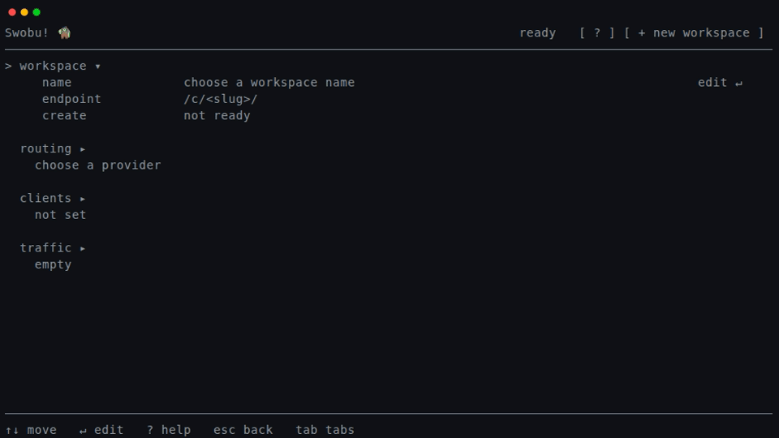

# Swobu

**Local AI gateway for routing clients across providers, regions, accounts, and local models.**

Connect AI clients once. Then route, balance, and fail over across providers, regions, accounts, and local models from one local control point.

> The client names the route. Swobu selects the target.

Swobu is beta. Behavior can change between releases.

---

## Demo



*Swobu Cockpit in a terminal.*

---

## Install

Install the release:

```sh
curl -fsSL https://swobu.com/install.sh | sh
```

The installer provides release binaries for macOS on Intel and Apple silicon, and for Linux on AMD64 and ARM64. It downloads `checksums.txt` and checks the SHA-256 of the archive before it installs.

If a release binary is not available for your platform, install from source:

```sh
go install github.com/swobuforge/swobu/cmd/swobu@master
```

Open Cockpit:

```sh
swobu
```

`swobu` attaches to the local daemon, or starts it, and then opens Cockpit.

Check the daemon:

```sh
swobu status
```

Stop the daemon:

```sh
swobu daemon down
```

You can leave the daemon running between Cockpit sessions.

---

## First route in Cockpit

Open Cockpit, then:

1. Add or select a workspace.
2. Add one route. The first route becomes the default route.
3. Add one target to the route.
4. Select a provider for the target.
5. Set the connection, the model, and the credential reference.
6. Note the workspace endpoint that Cockpit shows.

Each workspace has one default route. The model value `default` selects it. A different non-empty model value that does not match a route also selects it. An empty model value causes an error.

---

## Connect a client

A client needs two Swobu values:

1. The workspace endpoint.
2. The route name, sent as `model`.

Cockpit shows the workspace endpoint:

```text
http://127.0.0.1:7926/c/<workspace>
```

OpenAI-family clients use the workspace endpoint with `/v1`:

```text
http://127.0.0.1:7926/c/dev/v1
```

Anthropic-family clients use the workspace endpoint without `/v1`. They send requests to `/messages` and include an `anthropic-version` header.

If a client needs an API key field, use a non-secret placeholder such as `swobu`. Provider credentials stay in Swobu. Do not put a real provider credential in the client configuration.

---

## Current interfaces

These are the interfaces Swobu currently exposes. An interface being available
does not imply that every protocol-specific semantic can be translated across
every client/backend pair. Cross-family support claims come from the executed
[conformance suites](../test/integration/conformance/README.md); unsupported
whole-output contracts and unresolved provider effects fail explicitly.

### Tested clients

- Claude Code
- Codex CLI
- Continue
- OpenAI-family clients
- Anthropic-family clients

### Supported backends

- OpenAI
- Anthropic
- Azure AI
- AWS Bedrock
- OpenRouter
- Ollama
- ChatGPT
- Custom endpoints

### Request families

- OpenAI: `/chat/completions` and `/responses`, with their `/v1` forms
- Anthropic: `/messages`, with its `/v1` form
- Discovery: `/models`, with its `/v1` form (GET only)

### Streaming

- Server-Sent Events
- WebSocket on `/responses` only

---

## The Swobu routing model

```text
workspace
  route        client-visible model name
    tier       primary, or ordered fallback
      target   provider + connection + model + protocol + credential
```

A workspace gives one client context its own endpoint. A route is the model name that the client sends. A tier is a set of targets at the same priority. A target is one concrete backend.

Swobu does not make providers or deployments the same. Model behavior, protocol support, limits, and errors can differ between targets. Swobu controls these differences at one boundary. Swobu does not hide them.

---

## Security and privacy

Swobu is local-first: it binds to loopback by default (`127.0.0.1:7926`), keeps control traffic on your machine, and sends only anonymous aggregate telemetry (counts — no prompts, completions, auth, or identifiers). Turn it off with `swobu telemetry off` or `DO_NOT_TRACK`. Local-first is not offline-only; if you route to a hosted backend, the request still goes to that backend.

---

## Known gaps

- Protocol-specific behavior varies by client and backend. Swobu preserves
  portable semantics, records deliberate approximations or drops, and rejects
  operations whose authority or result contract cannot be preserved.
- Some clients need specific environment variables.
- Token and cache fields that providers report are not uniform.
- Swobu changes candidate target order; it does not read live provider quota, remaining TPM, or latency.
- The release installer covers Linux and macOS on AMD64 and ARM64 only.

---

## Documentation links

- [Documentation Root](https://swobu.com/docs/)
- [Quickstart Guide](https://swobu.com/docs/start/first-route/)
- [Provider Capabilities Reference](https://swobu.com/docs/reference/provider-capabilities/)
- [Protocols Reference](https://swobu.com/docs/reference/protocols/)
- [CLI Reference](https://swobu.com/docs/reference/cli/)
- [Configuration Reference](https://swobu.com/docs/reference/configuration/)

---

## Discuss your routing setup

If your model capacity is split across providers, regions, accounts, or local infrastructure, we will help you map your routes, balance capacity, and configure failover. Visit [`swobu.com/discuss/`](https://swobu.com/discuss/).

---

## Contributing and security reporting

We welcome contributions. Read [`CONTRIBUTING.md`](./CONTRIBUTING.md) before you open a pull request.

Swobu uses a Contributor License Agreement (`CLA.md`). When you submit a contribution, you agree to the terms in [`CLA.md`](./CLA.md).

For security vulnerabilities, do not report in public issues. Read [`SECURITY.md`](./SECURITY.md) before reporting.

---

## Development history

Swobu was reimplemented from the ground up during OpenAI Build Week using Codex with GPT-5.6. An earlier prototype established the idea, but none of its implementation remains.

During the hackathon, the daemon and Cockpit were rebuilt around a clean architecture, tiered routing and capability-aware fallback were added, and testing, linting, and visual verification were strengthened.

Codex and GPT-5.6 completed much of the code implementation while product semantics and architectural rails were defined in RFCs.

---

## License

Swobu uses the AGPL-3.0-only license. Read [`LICENSE`](./LICENSE).
