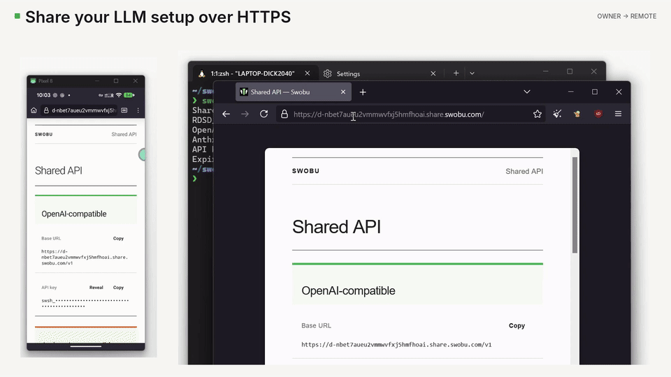
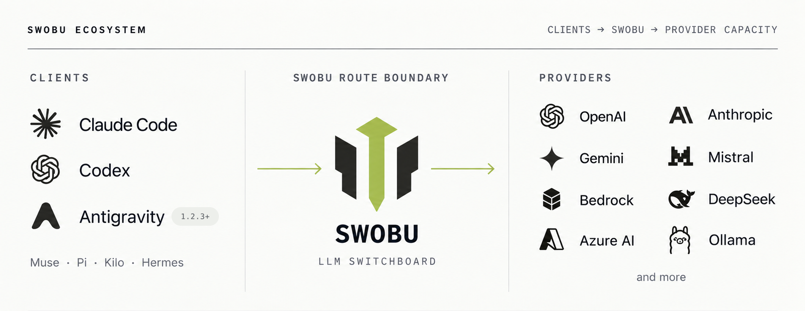

# [Swobu](https://swobu.com/) — LLM Switchboard

**English** · [简体中文](README.zh-CN.md) · [日本語](README.ja.md) · [Português (Brasil)](README.pt-BR.md) · [Bahasa Indonesia](README.id.md) · [한국어](README.ko.md) · [Русский](README.ru.md) · [Español](README.es.md) · [Українська](README.uk.md)

**Pool LLM capacity you already have.**

Put provider accounts, cloud regions, hosted endpoints, and local GPUs behind stable model names. Your agents keep one endpoint; Swobu handles routing, runtime fallback, and protocol translation underneath.

[Documentation](https://swobu.com/docs/) · [Quickstart](https://swobu.com/docs/start/first-route/) · [VS Code](https://marketplace.visualstudio.com/items?itemName=swobu.swobu&utm_source=swobu_docs&utm_medium=referral&utm_campaign=vscode_extension) · [Releases](https://github.com/swobuforge/swobu/releases)

<p align="center">
  
</p>

<p align="center">
  <picture>
    <source media="(max-width: 600px)" srcset="./assets/readme/ecosystem-mobile.png">
    
  </picture>
</p>

<p align="center"><sub>Compatibility shown, not partnership. Support varies by provider and runtime.</sub></p>

---

## Install

macOS, Linux, or WSL:

```bash
curl -fsSL https://swobu.com/install.sh | sh
```

Windows PowerShell:

```powershell
irm https://swobu.com/install.ps1 | iex
```

Cockpit opens after install. Add a provider, create a route, then connect an agent.

```bash
swobu connect claude
swobu connect codex
```

Muse, Pi, Kilo, and Hermes are also supported. Antigravity CLI 1.2.3 and newer connects through `swobu launch antigravity`; release qualification uses the exact certified 1.2.3 binary.

[Build your first route in five minutes →](https://swobu.com/docs/start/first-route/)

---

## Route once. Change the capacity underneath.

A Swobu **route looks like a model name** to your agent. It is the stable name
the agent already sends while Swobu owns the configured capacity behind it.

```text
agent: model = coding
          │
          ▼
        Swobu
          │
          ├─ Azure AI / region A
          ├─ Azure AI / region B
          ├─ AWS Bedrock
          └─ Ollama
```

Routes can pool provider accounts, regions, hosted endpoints, local servers, and models. Peer target order changes across attempts; fallback tiers define what happens after a real attempt fails. Swobu does not inspect live quota, price, health, or latency.

**Runtime fallback, not preflight.** Swobu does not preflight compatibility. It
sends the real request to the configured target, and a failed attempt can
advance to the next target in the route.

**Protocol translation at one boundary.** Current protocol families include OpenAI Responses, OpenAI Chat Completions, Anthropic Messages, and Gemini Interactions. Translation occurs where the requested semantics are representable.

[How routing works →](https://swobu.com/docs/) · [Capability matrix →](https://swobu.com/docs/)

---

## Share a route without sharing provider credentials

```text
swobu share dev/coding
```

A Share gives the remote client an HTTPS endpoint and bearer. Provider keys remain on the machine running Swobu. You can change what backs the route without changing the remote configuration, then revoke access when you are done.

Application TLS terminates on the owner machine running Swobu; the relay forwards encrypted application traffic and does not terminate that TLS.

[Workspace and Route Share →](https://swobu.com/docs/concepts/sharing/)

---

## Local-first

Swobu runs locally and exposes the endpoint your agents use. Provider credentials stay at that boundary. Requests leave your machine when a hosted target is selected. No Swobu account is required for local use. Operational telemetry is deliberately limited and can be disabled.

[Security & privacy →](https://swobu.com/docs/)

---

## Releases

Swobu publishes versioned Linux, macOS, and Windows binaries with SHA-256 checksums.

[Latest release →](https://github.com/swobuforge/swobu/releases/latest)

Build from source:

```bash
git clone https://github.com/swobuforge/swobu.git
cd swobu
make build
./.out/swobu --version
```
