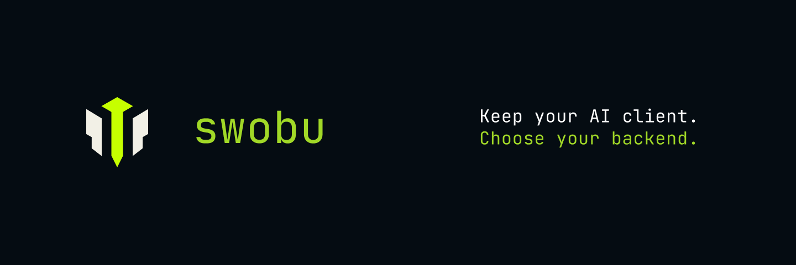

# Swobu



## Keep the client. Swap the backend.

Swobu is a local compatibility boundary for Claude Code, Codex, and other AI
clients. Route across providers without silently losing tools, reasoning, or
session state.

<video src="https://github.com/user-attachments/assets/ccaf3a78-eda0-4391-a493-d4ba6921fef0" controls muted playsinline width="640"></video>

*One backend lacks a capability the request needs. Swobu skips it and runs the other — the coding session continues.*

Point Claude Code, Codex, or another AI client at one local endpoint. Keep provider URLs, credentials, and routing at the boundary — not in the client. Swap the backend without accepting the provider's default boundary.

> The client names the route. Swobu selects the target.

Swobu is beta. Behavior can change between releases.

---

## Install

Install the release:

```sh
curl -fsSL https://swobu.com/install.sh | sh
```

The installer verifies the release and then starts `swobu`, which opens
Cockpit. For provisioning or CI, pass `--no-start` to `install.sh`, `-NoStart`
to `install.ps1`, or set `START_SWOBU=false`.

The installer provides release binaries for macOS on Intel and Apple silicon, and for Linux on AMD64 and ARM64. It downloads `checksums.txt` and checks the SHA-256 of the archive before it installs.

If a release binary is not available for your platform, install from source:

```sh
go install github.com/swobuforge/swobu/cmd/swobu@master
```

Open Cockpit:

```sh
swobu
```

`swobu` attaches to the local daemon, or starts it, and then opens Cockpit.

Use the same startup controls as `swobu daemon` when you need a different
loopback address or config file:

```sh
swobu --addr 127.0.0.1:9000 --config ./swobu.yaml
```

The equivalent environment controls are `SWOBU_ADDR` and
`SWOBU_CONFIG_PATH`. Explicit flags win over environment values.

Check the daemon:

```sh
swobu status
```

Stop the daemon:

```sh
swobu daemon down
```

Configure a supported local client through the same Workspace Connect operation
used by Cockpit:

```bash
swobu connect codex
swobu connect claude
swobu connect kilo
swobu connect pi
swobu connect openclaw
swobu connect hermes
```

Use `--workspace <name>` when multiple workspaces exist, `--addr <host:port>`
for another loopback daemon address, and `--replace` only to replace existing
different client configuration.

You can leave the daemon running between Cockpit sessions.

---

## First route in Cockpit

Open Cockpit, then:

1. Add or select a workspace.
2. Add one route. The first route becomes the default route.
3. Add one target to the route.
4. Select a provider for the target.
5. Set the connection, the model, and the credential reference.
6. Open the workspace endpoint row to connect a client or copy the workspace URL.

Each workspace has one default route. The model value `default` selects it. A different non-empty model value that does not match a route also selects it. An empty model value causes an error.

---

## Connect a client

In Cockpit, open the workspace's `endpoint` row. Eligible Codex CLI, Claude
Code, Kilo Code, pi, OpenClaw, and Hermes Agent installations appear as direct
rows. Select one, review the backend, endpoint, protocol, or capability leaves
that actually change, and apply them. Cockpit reports `configured` after the
configuration update succeeds.

For every other client, use `Other clients` to copy the canonical workspace
URL:

```text
http://127.0.0.1:7926/c/<workspace>
```

Use that value as the client's Base URL or Endpoint. Swobu accepts bare and
`/v1`-prefixed operation paths for Responses, Chat Completions, Messages, and
Models, so `/v1` is compatibility spelling rather than workspace identity. A
particular client may still impose its own validation or require a complete
operation URL; named integrations are added only after their root-URL contract
is verified.

If a client needs an API key field, use a non-secret placeholder such as `swobu`. Provider credentials stay in Swobu. Do not put a real provider credential in the client configuration.

---

## Current interfaces

These are the interfaces Swobu currently exposes. An interface being available
does not imply that every protocol-specific semantic can be translated across
every client/backend pair. Unsupported whole-output contracts and unresolved
provider effects fail explicitly.

### Tested clients

- Claude Code
- Codex CLI
- Continue
- OpenAI-family clients
- Anthropic-family clients

### Supported backends

- OpenAI
- Anthropic
- DeepSeek
- Z.AI
- Azure AI
- AWS Bedrock
- OpenRouter
- Ollama
- LM Studio
- vLLM
- ChatGPT
- OpenAI/Anthropic Compatible Endpoints

### Request families

- OpenAI: `/chat/completions` and `/responses`, with their `/v1` forms
- Anthropic: `/messages`, with its `/v1` form
- Discovery: `/models`, with its `/v1` form (GET only)

### Streaming

- Server-Sent Events
- WebSocket on `/responses` only

---

## The Swobu routing model

```text
workspace
  route        client-visible model name
    tier       primary, or ordered fallback
      target   provider + connection + model + protocol + credential
```

A workspace gives one client context its own endpoint. A route is the model name that the client sends. A tier is a set of targets at the same priority. A target is one concrete backend.

Swobu does not make providers or deployments the same. Model behavior, protocol support, limits, and errors can differ between targets. Swobu controls these differences at one boundary. Swobu does not hide them.

---

## Security and privacy

Swobu is local-first: it binds to loopback by default (`127.0.0.1:7926`) and keeps control traffic on your machine. It sends minimal operational telemetry — aggregate counts tied to a random installation id (not your account or machine) and the client product token, such as `claude-code/1.0.0`. It never sends prompts, completions, credentials, model output, or request bodies. Turn it off with `swobu telemetry off` or `DO_NOT_TRACK`. Local-first is not offline-only; if you route to a hosted backend, the request still goes to that backend.

---

## Known gaps

- Protocol-specific behavior varies by client and backend. Swobu preserves
  portable semantics, skips a target that cannot represent the request, and
  rejects operations whose authority or result contract cannot be preserved.
  Surfacing the per-target reason for a skip is direction, not shipped; today
  only the terminal outcome is visible.
- Some clients need specific environment variables.
- Token and cache fields that providers report are not uniform.
- Swobu changes candidate target order; it does not read live provider quota, remaining TPM, or latency.
- The release installer covers Linux and macOS on AMD64 and ARM64 only.

---

## Documentation links

- [Documentation Root](https://swobu.com/docs/)
- [Quickstart Guide](https://swobu.com/docs/start/first-route/)
- [Provider Capabilities Reference](https://swobu.com/docs/reference/provider-capabilities/)
- [Protocols Reference](https://swobu.com/docs/reference/protocols/)
- [CLI Reference](https://swobu.com/docs/reference/cli/)
- [Configuration Reference](https://swobu.com/docs/reference/configuration/)

---

## Discuss your routing setup

If your model capacity is split across providers, regions, accounts, or local infrastructure, we will help you map your routes, balance capacity, and configure failover. Visit [`swobu.com/discuss/`](https://swobu.com/discuss/).

---

## Contributing and security reporting

We welcome contributions. Read [`CONTRIBUTING.md`](./CONTRIBUTING.md) before you open a pull request.

Swobu uses a Contributor License Agreement (`CLA.md`). When you submit a contribution, you agree to the terms in [`CLA.md`](./CLA.md).

For security vulnerabilities, do not report in public issues. Read [`SECURITY.md`](./SECURITY.md) before reporting.

---

## Development history

Swobu was reimplemented from the ground up during OpenAI Build Week using Codex with GPT-5.6. An earlier prototype established the idea, but none of its implementation remains.

During the hackathon, the daemon and Cockpit were rebuilt around a clean architecture, tiered routing and capability-aware fallback were added, and testing, linting, and visual verification were strengthened.

Codex and GPT-5.6 completed much of the code implementation while product semantics and architectural rails were defined in RFCs.

---

## License

Swobu uses the AGPL-3.0-only license. Read [`LICENSE`](./LICENSE).
