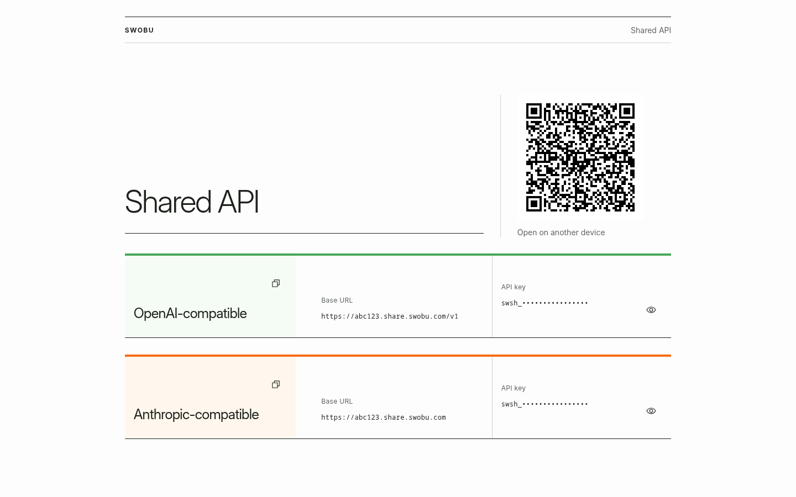

# [Swobu](https://swobu.com/) — LLM Switchboard

**Pool the LLM capacity you already have.**

Put AWS/Azure credits, provider accounts and quota, free APIs and local GPUs behind stable routes for Claude Code, Codex and other agents. Change the capacity behind a route without reconfiguring every client.

[Documentation](https://swobu.com/docs/) · [Quickstart](https://swobu.com/docs/start/first-route/) · [Releases](https://github.com/swobuforge/swobu/releases) · [VS Code](https://marketplace.visualstudio.com/items?itemName=swobu.swobu)

```bash
curl -fsSL https://swobu.com/install.sh | sh
```

Windows PowerShell: `irm https://swobu.com/install.ps1 | iex`

<p align="center">
  
</p>

## One route. Your capacity underneath.

A Swobu route looks like a model name to the client. You decide what sits behind it.

```text
Claude Code / Codex / OpenCode
              │
              │  model: work
              ▼
            Swobu
              │
              ├─ Azure / westus2 / gpt-5.6-sol
              ├─ Azure / westcentralus / gpt-5.6-sol
              └─ fallback: OpenAI / gpt-5.6-sol
```

The client keeps asking for `work`. You can change accounts, regions, providers or models behind that route independently.

**Runtime rule:** Swobu does not preflight compatibility. It attempts the real request against the configured target. If that attempt fails, it tries the next target in the route. Protocol translation happens per attempt; providers remain different.

## What the switchboard is for

| Job | Route pattern |
| --- | --- |
| **Use funded capacity before cash** | AWS/Azure/GCP-backed targets before direct paid APIs |
| **Aggregate quota** | same model across regions or accounts |
| **Make cheap capacity useful** | free/local targets first, paid fallback behind them |
| **Route agents by workload** | premium main route, cheap/free worker routes |
| **Keep policy out of clients** | local-first, region/provider restrictions, funded-first ordering |
| **Share configured capacity** | one HTTPS endpoint while routing and provider credentials stay owner-side |

Swobu does not inspect your credit balance, remaining TPM, price or latency. The route expresses your policy; Swobu executes it.

## One client endpoint, multiple provider protocols

```text
Claude Code ─┐
Codex ───────┤
OpenCode ────┤
Kilo ────────┤
Pi ──────────┼──── Swobu ────┬─ OpenAI Responses / Chat Completions
OpenClaw ────┤                ├─ Anthropic Messages
Hermes ──────┘                ├─ Gemini
                              └─ provider-specific endpoints
```

Swobu translates supported request semantics for each target attempt. Translation is not equivalence: provider-specific behavior remains observable, and unsupported combinations can fail and advance through the route.

Current docs cover **40 provider integrations**, including local inference, frontier APIs, hyperscalers and specialized inference platforms.

[Clients and provider setup →](https://swobu.com/docs/)

## Share the endpoint. Keep provider keys at home.

```bash
swobu share dev/coding
```

A shared route gives the recipient an HTTPS endpoint and Swobu bearer. Routing, fallback and provider credentials remain on the owner side. Change the targets later without changing the recipient's endpoint or route name.

<p align="center">
  
</p>

[Workspace and Route Share →](https://swobu.com/docs/concepts/sharing/)

## Connect an agent

Cockpit can configure supported clients, or use the CLI:

```bash
swobu connect claude
swobu connect codex
swobu connect opencode
swobu connect kilo
swobu connect pi
```

Provider credentials and routing stay behind Swobu rather than being copied into every client.

## Local-first

Swobu runs locally and exposes the endpoint your agents connect to. No Swobu account is required for local use.

Swobu sends privacy-minimized usage and reliability telemetry tied to a random installation ID. It does **not** send prompts, responses, credentials, endpoints or user-defined names. Disable it with `swobu telemetry off` or `DO_NOT_TRACK`.

[Security and privacy →](https://swobu.com/docs/)

## Build from source

```bash
git clone https://github.com/swobuforge/swobu.git
cd swobu
make build
./.out/swobu --version
```

Swobu publishes versioned binaries for Linux, macOS and Windows with SHA-256 checksums.

[Latest release →](https://github.com/swobuforge/swobu/releases/latest)

## License

Swobu is available under the [GNU AGPLv3](LICENSE). A [commercial license](COMMERCIAL-LICENSE.md) is also available.

---

**Translations:** [English](README.md) · [简体中文](README.zh-CN.md) · [日本語](README.ja.md) · [Português (Brasil)](README.pt-BR.md) · [Bahasa Indonesia](README.id.md) · [한국어](README.ko.md) · [Русский](README.ru.md) · [Español](README.es.md) · [Українська](README.uk.md)
